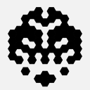

# HEXICON
[](https://www.npmjs.com/package/hexicon)
[](https://github.com/fortelle/hexicon/blob/master/LICENSE.txt)

A JavaScript library for generating identicons.


## Usage
``` javascript
let hexicon = new Hexicon({
  type: 'square',
  level: 5,
  background: '#f2f2f2',
  random: {
    string: 'Hello'
  }
});
let html = hexicon.toSVG();
```
which outputs:


## Configurations
### `options`

| Name | Type | Default | Description |
| - | - | - | - |
| `type` | string | *required* | The style of the pattern. |
| `random` | object | {} | The data used for randomization. If empty, a random seed is used.  |
| `size` | number | 512 | The height and width in pixels of the icon. |
| `background` | string | transparent | The background color of the icon. |
| `color` | string | "normal" | The color of the tiles. The value can be `normal`, `dark`, `light`, or a fixed html color. |
| `minimum` | float | 0.0 | The minimum proportion of the tiles. |

#### for `type=square`
| Name | Type | Default | Description |
| - | - | - | - |
| `level` | number | 5 | The number of rows and columns. |
| `symmetrical` | bool | true | If the shape is vertically symmetrical. |

#### for `type=hexagon`
| Name | Type | Default | Description |
| - | - | - | - |
| `level` | number | 4 | The number of layers of the centered hexagonal lattice. |
| `rotated` | bool | false | If true, changes the orientation of the shape. |
| `symmetrical` | bool | true | If the shape is vertically symmetrical. |

#### for `type=concentration`
| Name | Type | Default | Description |
| - | - | - | - |
| `level` | number | 6 | The number of layers of the concentric polygons. |
| `sides` | number | 6 | The sides of the polygons. |
| `rotated` | bool | false | If true, changes the orientation of the shape. |
| `bordered` | bool | false | If true, always shows the tiles on the outermost layer. |
| `symmetrical` | bool | true | If the shape is vertically symmetrical. |

### `options.random`
Use only one of the following at a time.
| Name | Type | Example |
| - | - | - |
| `string` | string | "foobar" |
| `bytes` | Array | [0x66, 0x6f, 0x6f, 0x62, 0x61, 0x72] |
| `hex` | string | "666F6F626172" |
| `seed` | number | 249808880 |

## Examples

<table style="text-align: center;">
<tbody>
<tr>
<td>


</td>
<td>


</td>
<td>


</td>
</tr>
<tr>
<td>

```json
{
  "type": "square"
}
```

</td>
<td>

```json
{
  "type": "square",
  "level": 8
}
```

</td>
<td>

```json
{
  "type": "square",
  "symmetrical": "false"
}
```

</td>
</tr>

<tr>
<td>


</td>
<td>


</td>
<td>


</td>
</tr>
<tr>
<td>

```json
{
  "type": "hexagon"
}
```

</td>
<td>

```json
{
  "type": "hexagon",
  "rotated": true
}
```

</td>
<td>

```json
{
  "type": "hexagon",
  "level": 10
}
```

</td>
</tr>

<tr>
<td>


</td>
<td>



</td>
<td>


</td>
</tr>
<tr>
<td>

```json
{
  "type": "hexagon",
  "minimum": 0.4
}
```

</td>
<td>

```json
{
  "type": "hexagon",
  "minimum": 0.6
}
```

</td>
<td>

```json
{
  "type": "hexagon",
  "minimum": 0.8
}
```

</td>
</tr>

<tr>
<td>


</td>
<td>


</td>
<td>


</td>
</tr>
<tr>
<td>

```json
{
  "type": "concentration",
  "sides": 5
}
```

</td>
<td>

```json
{
  "type": "concentration",
  "sides": 8
}
```

</td>
<td>

```json
{
  "type": "concentration",
  "bordered": true
}
```

</td>
</tr>
</tbody>
</table>
